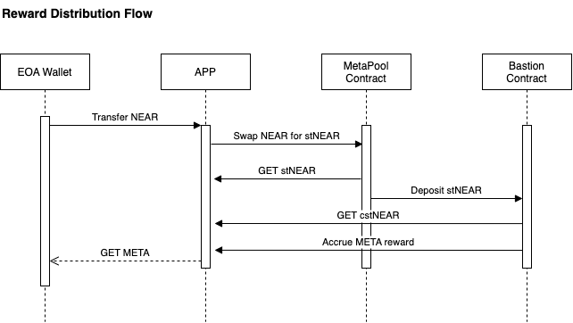

# 1) A working staking farm 2.0 smart contract: Clash of multiverses

Every PoS blockchain project faces one common problem: constant token supply. It augments the selling pressure of the token and lowers the long-term APR. To keep the PoS project’s APR sustainable, the key is to control the circulating supply of the token. In the case of Lido from the Ethereum network, the circulating supply is maintained by locking ETH. Meta pool conducts a similar operation in the NEAR network.  
 
Using Metapool’s stNEAR, NEAR can lower the circulating supply of the token by staking $NEAR. At the same time, the users can secure liquidity via $stNEAR. We decided to step further and devised the ‘Game’ layer to solve the excess circulation supply effectively.

We created a structure based on the Liquidity Mining DeFi model that allows the player to take an interest in other players’ interest farming operations in addition to his interest farming operations and added a gaming element.

[Game Structure]
The Liquidity Miner will have his area, or land while depositing LPs. This land is a space for interest farming, and any interest that comes out of this space can be harvested. However, at the same time, they have the chance to attack adjacent land (the area where another Liquidity Miner has deposited LP). They can take away the interest generated in the area with a random win rate.
Thus, attacks and defenses can occur between Liquidity Miners, and the probability of such attacks and defenses occurring is random, but this probability can be adjusted through items. The items can be purchased in $NEAR. And the $NEAR used to buy these items will be burned. 

This structure allows users who want to maximize their interest to achieve it by increasing the army during the game. These activities will trigger the purchase and burning of $NEAR. Hence, this allows for a sustainable APR model on $NEAR. 

# 2) Design documents and technical notes.
## Technical notes:

1. EOA purchases the army using $NEAR 
2. $NEAR used for the army purchase is exchanged for $stNEAR from META Pool (some are burned) 
3. $stNEAR holders can benefit from the additional reward ($META) by depositing at Bastion Contract  
4. When the user gains the land, one can claim the rewards from $stNEAR and $META. The more land-gaining activities lead to a boost in $NEAR burning & lock-up, which lowers the total circulating supply of NEAR.

## Architecture

## Contract Addresses on Aurora mainnet
Game: [0x893b67c8ED7A9dDA1c3e96B9612E2745805b3537](https://aurorascan.dev/address/0x893b67c8ED7A9dDA1c3e96B9612E2745805b3537)

Multicall: [0x634AF206B3c5DDE10839d13b77d4727Aab95B8D7](https://aurorascan.dev/address/0x634AF206B3c5DDE10839d13b77d4727Aab95B8D7)

## Demo site
[clash of multiverses demo](http://clash-of-multiverses.s3-website-us-west-1.amazonaws.com/)

## Demo video
[clash of multiverses demo video](https://www.youtube.com/watch?v=diQa94kJMGY)